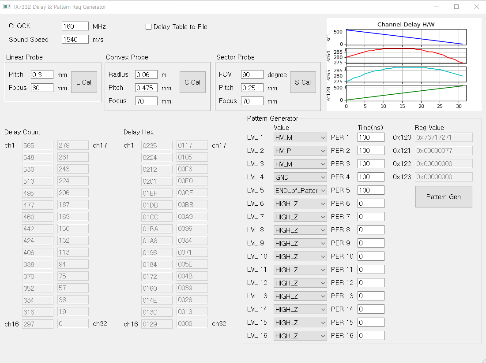

# TX7332 Delay & Pattern Register Generator

## Description
TX7332 Pattern Delay Register Generator는 TX7332 칩의 패턴 딜레이 레지스터 값을 생성하는 프로그램입니다.

## GUI Screenshot

## Features
- Pattern Delay Register 생성
- Pattern profile Register 생성
- GUI 인터페이스 제공

## Requirements
- Python 3.9.12
- PyQt5
- pandas
- numpy

## Executable File
- pyinstaller
